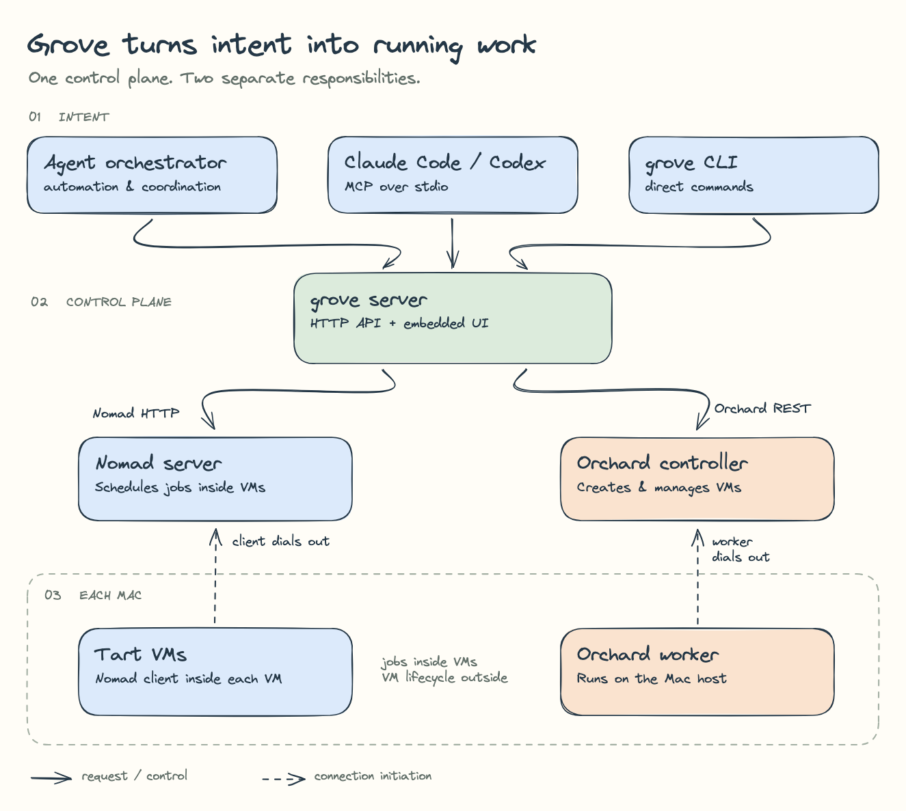

# Claude Plugins & Shell Configs

This repo contains shell configs (zsh functions, zellij, nvim, kitty, Docker sandbox templates) and a plugin marketplace for Claude Code.

| :warning: WARNING           |
|:----------------------------|
| Maybe they work for you too, maybe they won't. |
| Maybe they'll make claude hallucinate and wipe your computer 🤷 |
| Install at your own risk. |

## Pretty Diagrams

`plugins/pretty-diagrams` provides a reusable diagram skill, art-direction prompt,
and a single-container local Excalidraw editor plus the official Excalidraw MCP server.

```sh
docker compose -f plugins/pretty-diagrams/runtime/compose.yaml up -d --build
```

Open [the local editor](http://127.0.0.1:3100). Agents connect over Streamable HTTP
at `http://127.0.0.1:3100/mcp`. Add this repository as a Claude Code plugin marketplace
and install `pretty-diagrams`; its `.mcp.json` configures the endpoint. The skill is
also a standard `SKILL.md` directory and the plugin includes a Codex manifest.

See the [skill](plugins/pretty-diagrams/skills/pretty-diagrams/SKILL.md),
[local runtime details](plugins/pretty-diagrams/skills/pretty-diagrams/references/runtime.md),
and [reusable visual prompt](plugins/pretty-diagrams/skills/pretty-diagrams/references/art-direction.md).



[Editable Excalidraw example](plugins/pretty-diagrams/examples/grove.excalidraw) ·
[SVG](plugins/pretty-diagrams/examples/grove.svg)

## Shell Configs

See [`shell-configs/CLAUDE.md`](shell-configs/CLAUDE.md) for setup instructions covering:

- **kitty** terminal emulator config
- **zellij** multiplexer config + layouts
- **nvim** (AstroNvim) config
- **zsh functions** — worktree manager (`wt`), Claude launcher (`cl`), Docker sandbox (`clauded`/`codexd`), and more
- **Docker sandbox template** — custom `gm-claude-dev` image with zellij, nvim, starship, and dev tools

## License

MIT
